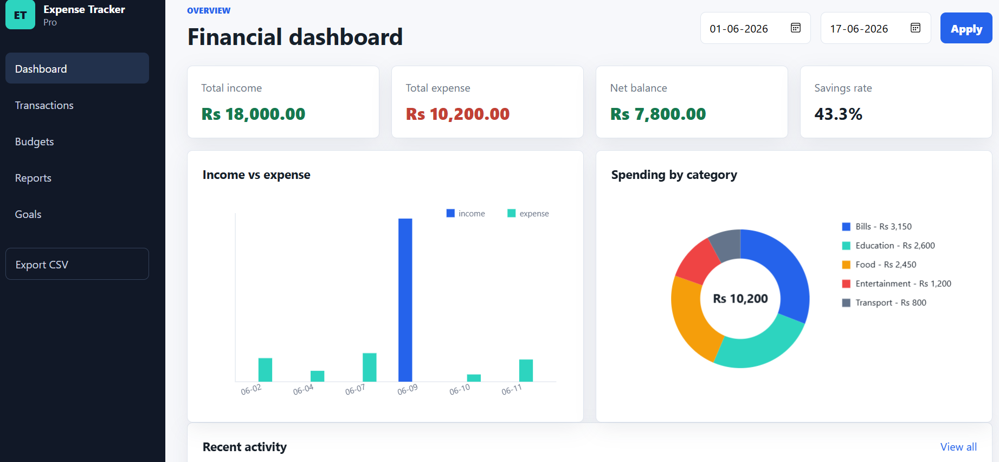
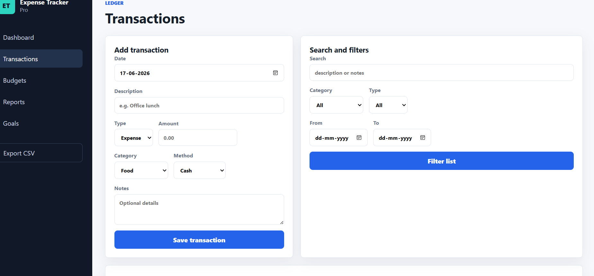
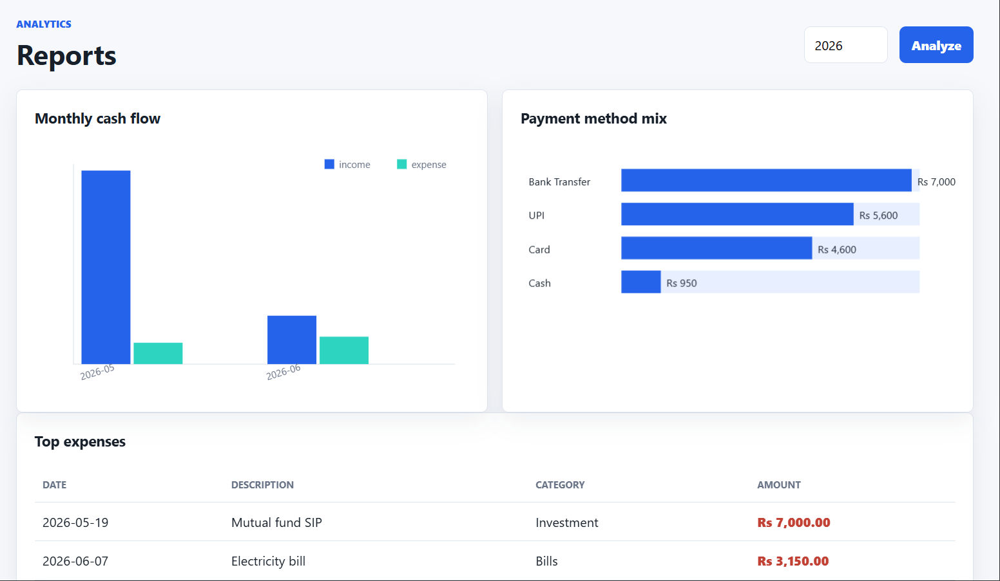

# Expense Tracker Pro

Advanced multi-page Python expense tracker using only the Python standard library.
## 📸 Screenshots

### Dashboard


### Transactions


### Budgets


### Reports


## Features

- Dashboard with income, expense, balance, savings rate, and charts
- Add, search, filter, and delete transactions
- SQLite database storage
- Monthly budget tracking with progress bars
- Reports page with yearly cash flow and payment method charts
- Savings goals page
- CSV export
- Responsive desktop and mobile layout

## Run

Easy way:

Double-click `START_EXPENSE_TRACKER.bat`, then open:

```text
http://127.0.0.1:8000
```

Manual way:

```powershell
cd "C:\Users\SHUBHAM VERMA\Documents\Codex\2026-06-11\as-you-are-my-project-maker\outputs\expense_tracker"
python app.py
```

Open:

```text
http://127.0.0.1:8000
```

The app creates `data/expenses.db` automatically and seeds sample data the first time it runs.